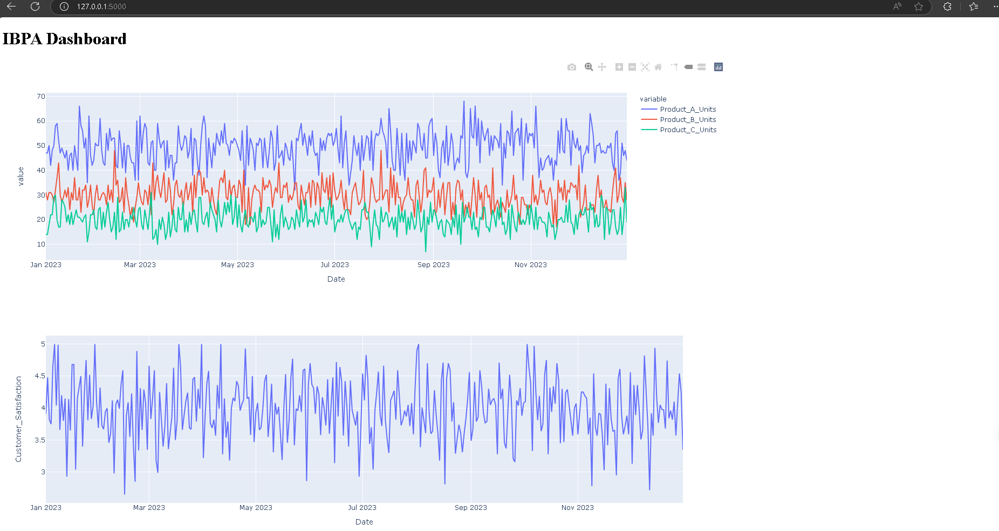

# Intelligent Business Process Automation (IBPA) System

## Overview
The Intelligent Business Process Automation (IBPA) system is a multi-agent AI solution designed to analyze, optimize, and automate business processes. Leveraging the power of CrewAI, this system employs specialized AI agents to perform data analysis, process optimization, and automation implementation.

## Dashboard Screenshots




## Features

1. **Data Analysis**
   * Utilizes a Data Analyst agent to identify trends and inefficiencies in company data
   * Processes historical sales, expenses, and customer satisfaction data
   * Generates insights on top inefficiencies in business processes

2. **Process Optimization**
   * Employs a Process Optimizer agent to develop improvement strategies
   * Creates actionable plans to address identified inefficiencies
   * Leverages Lean Six Sigma methodologies for optimization

3. **Automation Implementation**
   * Features an Automation Engineer agent to design and implement automated solutions
   * Focuses on the top priority improvements identified by the Process Optimizer
   * Aims to streamline operations and reduce manual intervention

4. **Multi-Agent Collaboration**
   * Utilizes CrewAI to orchestrate collaboration between specialized AI agents
   * Implements a sequential workflow for cohesive analysis, optimization, and automation

5. **Mock Data Generation**
   * Includes utilities to generate realistic mock data for testing and demonstration
   * Simulates a year's worth of daily business data including sales, expenses, and customer satisfaction scores

6. **Interactive Dashboard**
   * Provides a web-based dashboard for visualizing results
   * Displays sales trends, customer satisfaction metrics, and target achievements
   * Presents detailed supply chain optimization strategies

## Sample Results

Our IBPA system generates comprehensive business insights and optimization strategies. Here's a brief overview of a sample output:

### Supply Chain Optimization Plan

1. **Inventory Management Strategies**:
   - Implement Just-In-Time (JIT) Inventory Systems to reduce holding costs and minimize waste
   - Use advanced analytics for demand forecasting, considering seasonal trends and promotional activities
   - Leverage RFID and barcode systems for real-time inventory tracking

2. **Supplier Relationship Improvements**:
   - Consolidate suppliers to foster deeper relationships and improve communication
   - Develop performance metrics for suppliers, including lead times, quality of goods, and reliability
   - Conduct regular planning meetings with key suppliers to discuss demand forecasts and potential challenges

3. **Logistics Enhancements**:
   - Optimize delivery routes to reduce transportation costs and improve delivery times
   - Streamline warehouse and distribution center locations based on sales data
   - Explore third-party logistics (3PL) partnerships for more efficient shipping solutions

4. **Continuous Improvement & Feedback Loops**:
   - Utilize customer satisfaction data to inform supply chain practices
   - Establish quarterly reviews of supply chain metrics in relation to costs, efficiency, and customer satisfaction

For full details and interactive visualizations, please refer to the dashboard.

## Project Structure

```
ibpa_project/
│
├── src/
│   ├── agents/
│   │   └── agents.py
│   ├── tasks/
│   │   └── tasks.py
│   └── utils/
│       └── data_utils.py
│
├── templates/
│   └── dashboard.html
├── static/
│   └── [static files for dashboard]
├── images/
│   ├── ibpa_dashboard_screenshot.png
│   └── supply_chain_optimization_screenshot.png
├── main.py
├── dashboard.py
├── requirements.txt
└── README.md
```

## Setup Instructions

1. **Clone the repository**
   ```
   git clone [repository-url]
   cd ibpa_project
   ```

2. **Set up a virtual environment**
   ```
   python -m venv ibpa_env
   ibpa_env\Scripts\activate  # On Windows
   source ibpa_env/bin/activate  # On Unix or MacOS
   ```

3. **Install dependencies**
   ```
   pip install -r requirements.txt
   ```

## Usage

Run the main script to start the IBPA system:
```
python main.py
```

This will initiate the following process:
1. Generate mock business data
2. Analyze the data for inefficiencies
3. Develop process improvement strategies
4. Create automation scripts for priority improvements

To view the dashboard:
```
python dashboard.py
```
Then open a web browser and navigate to `http://localhost:5000`.

## Customization

* Modify `src/utils/data_utils.py` to change mock data generation or integrate with real data sources
* Adjust agent parameters in `src/agents/agents.py` to fine-tune agent behaviors
* Customize tasks in `src/tasks/tasks.py` to alter the specific jobs assigned to each agent
* Update `dashboard.py` and `templates/dashboard.html` to modify the web dashboard

## Future Enhancements

* Integration with real-time data sources
* Implementation of more sophisticated AI models for each agent
* Expansion of the agent crew to cover more specialized business functions
* Advanced analytics and predictive modeling capabilities
* User authentication and multi-user support for the dashboard

## Contributing

Contributions to the IBPA project are welcome! Please feel free to submit pull requests, report issues, or suggest new features. For major changes, please open an issue first to discuss what you would like to change.

## License


## Contact

For any questions or support, please contact: https://www.linkedin.com/in/efuetngong-dion-72b188285/

---

We hope this Intelligent Business Process Automation system helps streamline your business operations and drive efficiency. Thank you for your interest in our project!